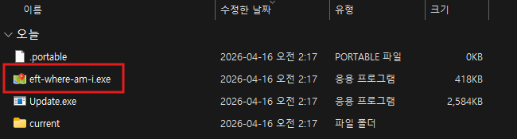
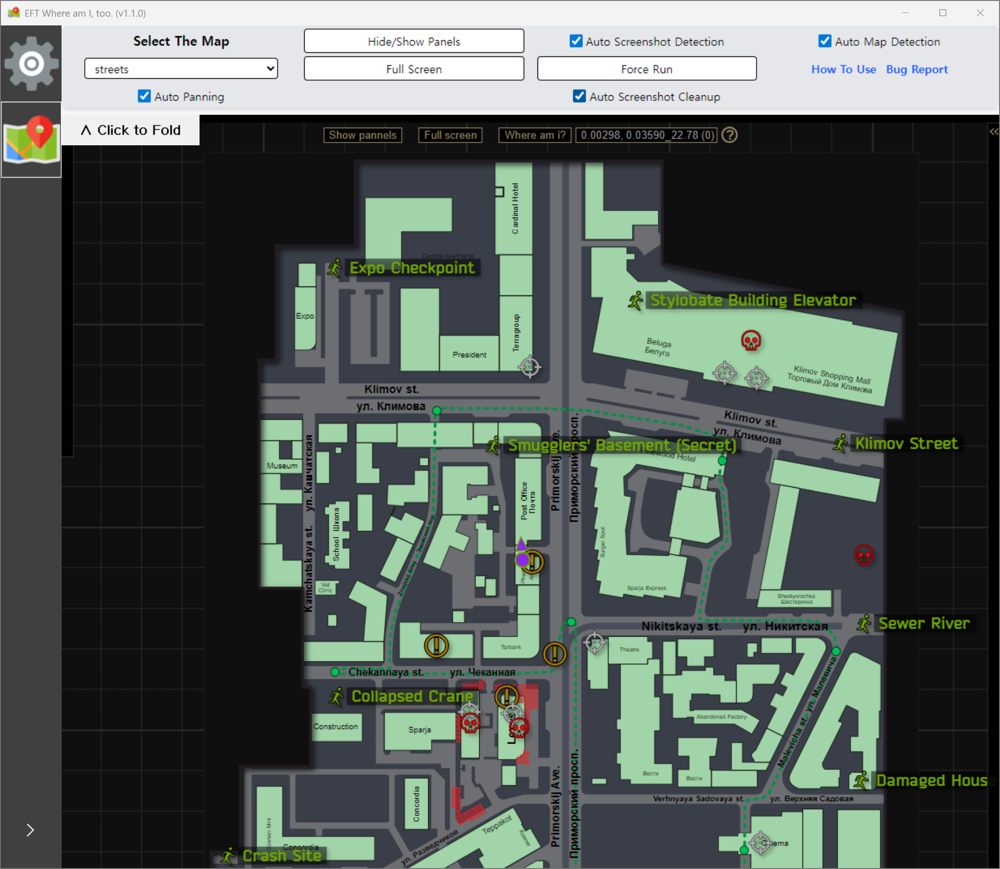
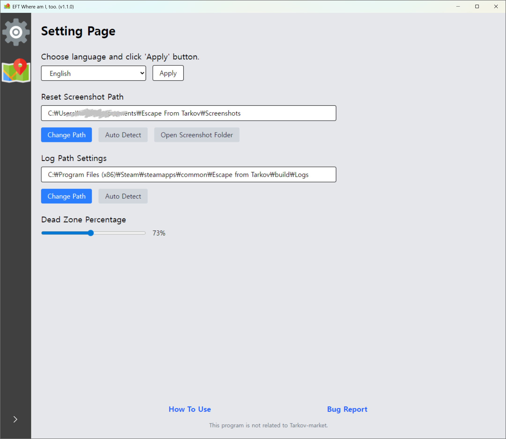

> **[English](README_en.md)** | **한국어 (현재)**

# EFT: Where Am I Too

타르코프 보조 프로그램 Where Am I을 개인적으로 수정한 버전입니다.

기존의 Where Am I가 오류와 부족한 유틸성을 강화한 버전입니다.
써본 사람들은 알 수 있는데 기존의 TarkovHelper의 기능들을 조금 구현해 놨습니다.

> [!WARNING]
> 본 프로그램은 [MIT 라이선스](./LICENSE)로 배포되며, **본 프로그램 사용으로 인한 어떠한 피해(BSG에 의한 제재 등)에 대해서도 책임지지 않습니다.**
> 본 프로그램은 [tarkov-market.com](https://tarkov-market.com/)과 공식적인 관계가 없으며, 맵 데이터와 UI를 활용하고 있습니다.

## 목차

- [Where Am I와 다른점](#where-am-i와-다른점)
- [시스템 요구 사항](#시스템-요구-사항)
- [다운로드 및 설치](#다운로드-및-설치)
- [사용 방법](#사용-방법)
- [설정](#설정)
- [기여하기](#기여하기)
- [버그 신고 및 건의](#버그-신고-및-건의)
- [크레딧 및 감사](#크레딧-및-감사)
- [라이선스](#라이선스)

## Where Am I와 다른점

### 위 아래로 위치가 자주 어긋나던 버그 수정

기존 Where Am I에서 있었던 가장 큰 버그입니다.
저도 이 버그때문에 제가 쓰려고 수정을 결심했습니다.
현재는 완벽히 수정되었습니다.

### 레이드 시작시 자동으로 해당 맵 열기

레이드 시작을 자동으로 감지하여 해당 맵으로 변경합니다.
이 옵션은 로그폴더를 지정해야만 사용이 가능합니다.
혹, 자동로그폴더 지정이 불가하다면 게임을 껏다 켜보시길 부탁드립니다.

### 자동패닝

위치 마커가 뷰포트의 가장자리(데드존)에 도달하면 맵을 자동으로 이동시켜 마커가 항상 화면 안에 보이도록 합니다. 데드존 비율은 설정에서 조절할 수 있습니다.
50%부터 99%까지 설정 가능하고 50%로 갈수록 중앙에 가깝게 99%에 가까울수록 가장자리에 가깝게 패닝됩니다.

#### 50%일때

#### 99%일때

### 게임내에서 Ctrl + NumPad의 조합으로 층 이동

게임내에서 Ctrl + NumPad를 이용하여 바로 층 이동이 가능하도록 만들었습니다.
이 기능은 타르코프 헬퍼를 참조하였습니다.
게임이 활성화중일때만 사용가능합니다.

### 퀘스트 자동저장・자동 불러오기

퀘스트를 우클릭해서 지정하면 자동으로 저장됩니다. 다시 우클릭해서 해제하면 저장삭제됩니다.
맵을 바꿨다가 다시 그 맵으로 돌아오면 자동으로 불러오기합니다.
타르코프마켓의 페이지를 그대로 사용하는지라 무료는 3개까지, 유료는 무제한으로 저장가능합니다.

### 패널의 숨김상태를 저장・불러오기

타르코프마켓의 패널의 상태를 저장합니다. 맵을 바꿨다가 다시 그 맵으로 돌아오면 저장되었던 상태로 변경합니다.

    아직 패널 안의 내용(보스, 저격스캐브, 컬티 등)은 저장되지 않습니다. - 추후 업뎃 예정

### 스크린샷 자동삭제

레이드 종료시 자동인식하여 스크린샷파일을 정리합니다.
스크린샷을 보존해야하는 사람들은 체크해제하여 주세요.

## 시스템 요구 사항

| 항목 | 요구 사항 |
|------|-----------|
| OS | Windows 10 1809+ / Windows 11 |
| 런타임 | [.NET 8.0 Desktop Runtime (x64)](https://dotnet.microsoft.com/download/dotnet/8.0) |
| 브라우저 | [WebView2 Runtime](https://developer.microsoft.com/en-us/microsoft-edge/webview2/) (대부분 사전 설치됨) |
| 네트워크 | 인터넷 연결 필수 (tarkov-market.com 접속) |
| 디스크 | ~50 MB |

## 다운로드 및 설치

### 다운로드

[Releases](https://github.com/karpitony/eft-where-am-i/releases/latest)에서 최신 버전의 `.zip` 파일을 다운로드하세요.

1. `.zip` 파일을 다운로드합니다.
2. 원하는 위치에 압축을 해제합니다.
3. `eft-where-am-i.exe`를 실행합니다.

> 혹 실행이 안된다면 [시스템 요구사항](#시스템-요구-사항)의 런타임을 받아주세요.

### Windows 보안 경고

Windows SmartScreen 경고가 표시될 수 있습니다. `추가 정보` → `실행`을 클릭하세요. 바이러스가 포함되어 있지 않으며, [VirusTotal 검사 결과](https://www.virustotal.com/gui/file/d0642330aaf009d3cf57a2bf55cb665f6c60178fd433c29600323fe6eb121f10?nocache=1/detection)를 확인할 수 있습니다.

    MaxSecure에 1개 걸려있긴한데, 네이버 사이트도 걸면 한개정도는 걸립니다. 1개 걸린다고 바이러스 아니에요

### 첫 실행

첫 실행 시 EFT 스크린샷 폴더와 로그 폴더 경로를 자동으로 감지합니다. 경로가 올바르지 않은 경우 설정에서 수동으로 변경하거나 `Auto Find` 버튼을 사용하세요.

## 사용 방법

### 기본 사용법

**1. 맵을 선택합니다.**

좌측 상단에서 맵을 선택합니다. 자동 맵 감지를 활성화하면 레이드 진입 시 자동으로 전환됩니다.

## 설정

| 설정 항목 | 설명 |
|-----------|------|
| 언어 | 한국어 / English |
| 스크린샷 경로 | EFT 스크린샷 폴더 경로 (`Change` / `Auto Find`) |
| 로그 경로 | EFT 게임 로그 폴더 경로 |
| 자동 스크린샷 감지 | 스크린샷 촬영 시 자동 위치 갱신 |
| 자동 맵 감지 | 레이드 진입 시 자동 맵 전환 |
| 자동 패닝 | 데드존 기반 자동 맵 이동 |
| 층 구역 편집기 | 다층 맵의 층 구역 편집 |

## 기여하기

PR과 Issue 기여를 환영합니다!

1. 이 저장소를 Fork합니다.
2. 기능 브랜치를 생성합니다. (`git checkout -b feature/my-feature`)
3. 변경 사항을 커밋합니다.
4. Pull Request를 생성합니다.

`floor_db.json`에 새로운 맵의 층 데이터를 추가하는 기여도 매우 환영합니다.

## 버그 신고 및 건의

버그 신고, 기능 건의 등은 [Issues](https://github.com/karpitony/eft-where-am-i/issues)에서 남겨주세요.

## 크레딧 및 감사

- [Tarkov-Market](https://tarkov-market.com/) — 맵 데이터 및 UI
- [Tarkov-Client](https://github.com/byeong1/Tarkov-Client) by byeong1 — 방향 표시기 코드 (MIT License)
- [Freepik - Flaticon](https://www.flaticon.com/free-icons/map) — 맵 아이콘
- [Microsoft WebView2](https://developer.microsoft.com/en-us/microsoft-edge/webview2/) — 브라우저 컴포넌트

## 라이선스

MIT License — Copyright (c) 2024 karpitony, Copyright (c) 2026 supnoel

자세한 내용은 [LICENSE](./LICENSE) 파일을 참조하세요.

> [!CAUTION]
> 본 프로그램은 BSG/Battlestate Games와 무관하며, 사용으로 인한 게임 내 제재 등 어떠한 불이익에 대해서도 개발자는 책임지지 않습니다. 사용에 따른 위험은 본인이 감수해야 합니다.
