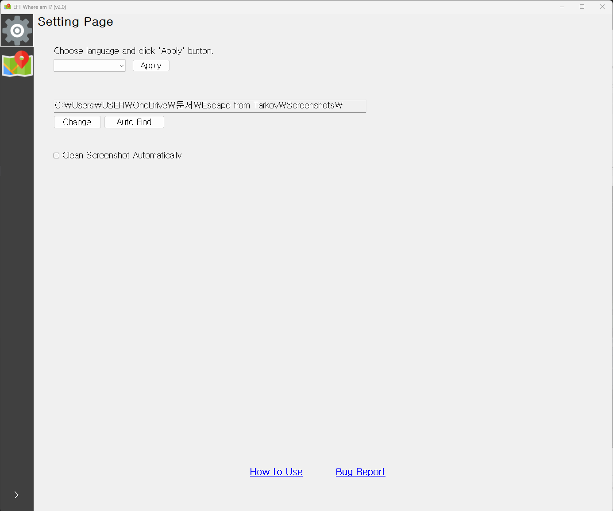

# eft-where-am-i
[한국어](README_ko_kr.md)

- A Python + GUI program that helps you easily use the `Maps` feature of `Tarkov-Market`.
- Based on [Rok's post and source code](https://gall.dcinside.com/m/eft/2143712).
- This program is licensed under the `MIT License` and **we are not responsible for any damages caused by this program**.

## How to use
**1. Choose a map.**

After selecting a map, make sure to click the `Apply` button!

**2. Take a screenshot inside the Tarkov raid.**
The default screenshot key in Tarkov is `PrtSc`. Please take note.

**3. Press the `Run` button.**

Your location will be marked on the map as a red dot.

- If you want to know your updated location after moving, repeat steps 2 and 3.
- Use the `Hide/Show Panels` or `Full Screen` buttons to view the map more clearly.
