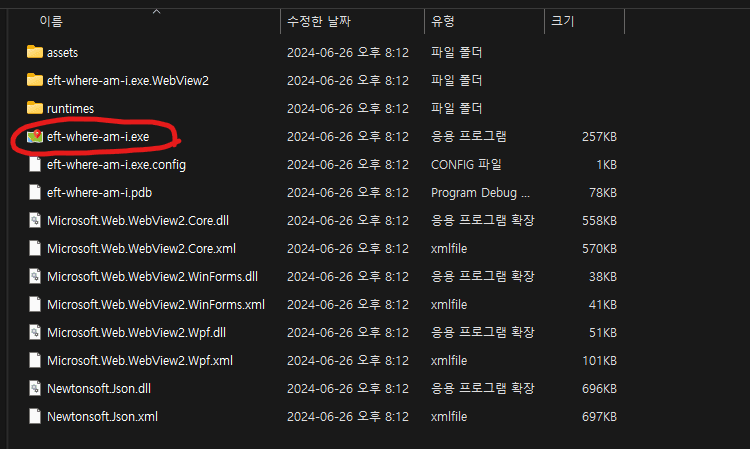

# EFT: Where Am I

[English](README_en.md)

- `Tarkov-Market`의 `Maps` 기능을 손쉽게 사용할 수 있도록 도와주는 C# Winform 프로그램입니다.
- 본 프로그램은 `MIT 라이선스`이며 **본 프로그램으로 인한 어떠한 피해**(BSG에 의한 제재 등)**에 대하여 책임지지 않습니다.**
- 버그 신고, 건의사항 등은 [Issue](https://github.com/karpitony/eft-where-am-i/issues)를
통해 남겨주세요.
- PR, issue 등 기여는 언제나 환영합니다.

 

## 다운로드

[Releases](https://github.com/karpitony/eft-where-am-i/releases)에서
최신 버전의 `.zip` 파일을 다운로드 받으실 수 있습니다. 다운받은 원하는 위치에서
압축을 풀고 `eft-where-am-i.exe`를 실행하시면 됩니다. 보안 경고가 표시될 수
있습니다. 바이러스는 없으니 `추가 정보`를 눌러 `실행`을 눌러주세요. [VirusTotal](https://www.virustotal.com/gui/file/4aa4768640a4c29ddc42ad1bc736d70c98630149985477e153bdae93aa91f010/detection)

## 사용 방법

**1. 맵을 골라주세요.**

좌측 상단의 맵을 고른 후 꼭 `적용` 버튼을 눌러주세요!
 

**2. 타르코프 레이드 안에서 스크린샷을 찍어주세요.**

- 타르코프의 기본 스크린샷 키는 `PrtSc`입니다. (다른 키를 사용해도 괜찮습니다.)
- `자동 스크린샷 감지`를 활성화하면 스크린샷을 찍을때마다 자동으로 위치가 업데이트 되며 3단계를 수행하지 않아도 됩니다.
 

**3. `강제 실행` 버튼을 눌러주세요.**

빨간 점의 형태로 맵에 표시됩니다.

- 이동한 후 변경된 나의 위치를 알고싶으면 2번과 3번 과정을 반복해주세요.
- `Hide/Show Pannels`나 `Full Screen` 버튼을 눌러 맵을 더 깔끔하게 볼 수 있습니다.
 

**4. 설정을 더 하고싶으시면 좌측 톱니바퀴 아이콘을 눌러주세요.**

- `Change`버튼을 눌러 경로를 원하는 폴더로 변경하실 수 있습니다.
- 혹시 설정을 잘못 하셔서 경로가 이상하게 설정된 것 같으시면 `Auto Find`를 눌러 자동 탐색을 하실 수 있습니다.
- 아직 다언어와 자동 스크린샷 지우기는 지원하지 않고 있습니다. 추후 버전을 기대해주세요!
