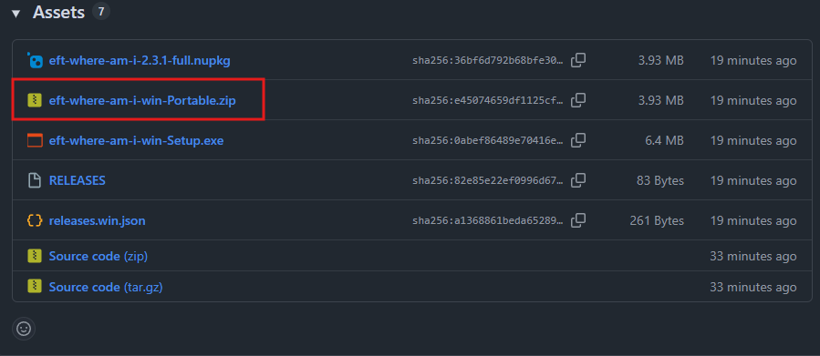

> **English (Current)** | **[한국어](README.md)**

# EFT: Where Am I

A Tarkov companion tool "Where Am I".

It provides various convenience features such as in-game location tracking and automatic map switching.
Some features from TarkovHelper have also been implemented.

> [!WARNING]
> This program is distributed under the [MIT License](./LICENSE). **We are not responsible for any consequences (including BSG bans or sanctions) resulting from the use of this program.**
> This program is not officially affiliated with [tarkov-market.com](https://tarkov-market.com/) and utilizes its map data and UI.

## Table of Contents

- [Key Features](#key-features)
- [System Requirements](#system-requirements)
- [Download & Installation](#download--installation)
- [How to Use](#how-to-use)
- [Settings](#settings)
- [Contributing](#contributing)
- [Bug Reports & Suggestions](#bug-reports--suggestions)
- [Credits & Acknowledgments](#credits--acknowledgments)
- [License](#license)

## Key Features

### Auto map switch on raid start

Automatically detects raid start and switches to the corresponding map.
This option requires the log folder path to be set.
If auto log folder detection doesn't work, please try restarting the game.

### Auto Panning

When the location marker reaches the edge (deadzone) of the viewport, the map automatically scrolls to keep the marker visible on screen. The deadzone percentage can be adjusted in settings.
It can be set from 50% to 99% — closer to 50% means panning centers the marker more, while closer to 99% allows the marker to stay near the edge.

#### At 50%

#### At 99%

### Floor switching with Ctrl + NumPad in-game

You can switch floors directly in-game using Ctrl + NumPad combinations.
This feature was inspired by Tarkov Helper.
It only works while the game is the active window.

### Auto save & auto restore quests

Right-click a quest to select it and it will be saved automatically. Right-click again to deselect and the saved entry will be removed.
When you switch maps and return, your quests are automatically restored.
Since it uses the tarkov-market page as-is, free users can save up to 3 quests, while paid users can save unlimited quests.

### Save & restore panel hidden state

Saves the state of the tarkov-market panel. When you switch maps and return, the panel state is restored.

    The contents inside the panel (boss, sniper scav, cultist, etc.) are not saved yet — planned for a future update.

### Auto Screenshot Cleanup

Automatically detects raid end and cleans up screenshot files.
If you need to preserve your screenshots, please uncheck this option.

## System Requirements

| Component | Requirement |
|-----------|-------------|
| OS | Windows 10 1809+ / Windows 11 |
| Runtime | [.NET 10.0 Desktop Runtime (x64)](https://dotnet.microsoft.com/download/dotnet/10.0) |
| Browser | [WebView2 Runtime](https://developer.microsoft.com/en-us/microsoft-edge/webview2/) (pre-installed on most systems) |
| Network | Internet connection required (connects to tarkov-market.com) |
| Disk | ~50 MB |

## Download & Installation

### Download

Download the latest `.zip` file from [Releases](https://github.com/karpitony/eft-where-am-i/releases/latest).

1. Download the `.zip` file.
2. Extract it to your preferred location.
3. Click and run `eft-where-am-i.exe`.

### ⚠️ App not launching or throwing errors? (.NET Runtime)

If the program does nothing when you open it or throws a system error, you likely need to install the **.NET 10.0 Desktop Runtime**.

1. Go to the [.NET 10.0 Download Page](https://dotnet.microsoft.com/download/dotnet/10.0).
2. Look for the **`.NET Desktop Runtime 10.0.x`** section under the "Run apps - Runtime" category.
3. Under the Installers column for **`Windows`**, click **`x64`** to download and install it.

> 💡 **NOTE:** Make sure you specifically download the **Desktop Runtime**. Standard `.NET Runtime` or `SDK` will not work for running this application.

### First Launch

On first launch, the tool automatically detects your EFT screenshot and log folder paths. If the detected paths are incorrect, you can change them manually in Settings or use the `Auto Find` button.

## How to Use

### Basic Usage

**1. Select a map.**

Choose a map from the top-left dropdown. If Auto Map Detection is enabled, the map switches automatically when you enter a raid.

## Settings

| Setting | Description |
|---------|-------------|
| Language | Korean / English |
| Screenshot Path | Path to EFT screenshot folder (`Change` / `Auto Find`) |
| Log Path | Path to EFT game log folder |
| Auto Screenshot Detection | Automatically update location when screenshots are taken |
| Auto Map Detection | Automatically switch maps when entering a raid |
| Auto Panning | Deadzone-based automatic map scrolling |
| Floor Zone Editor | Edit floor zones for multi-level maps |

## Contributing

PRs and Issues are always welcome!

1. Fork this repository.
2. Create a feature branch. (`git checkout -b feature/my-feature`)
3. Commit your changes.
4. Open a Pull Request.

Contributions to `floor_db.json` with floor data for new maps are highly appreciated.

## Bug Reports & Suggestions

Please report bugs, suggest features, or ask questions via [Issues](https://github.com/karpitony/eft-where-am-i/issues).

## Credits & Acknowledgments

- [Tarkov-Market](https://tarkov-market.com/) — Map data and UI
- [Tarkov-Client](https://github.com/byeong1/Tarkov-Client) by byeong1 — Direction indicator code (MIT License)
- [Freepik - Flaticon](https://www.flaticon.com/free-icons/map) — Map icon
- [Microsoft WebView2](https://developer.microsoft.com/en-us/microsoft-edge/webview2/) — Browser component

## License

MIT License — Copyright (c) 2024 karpitony, Copyright (c) 2026 supnoel

See the [LICENSE](./LICENSE) file for details.

> [!CAUTION]
> This program is not affiliated with BSG/Battlestate Games. The developer assumes no responsibility for any in-game penalties, bans, or other consequences resulting from its use. Use at your own risk.
