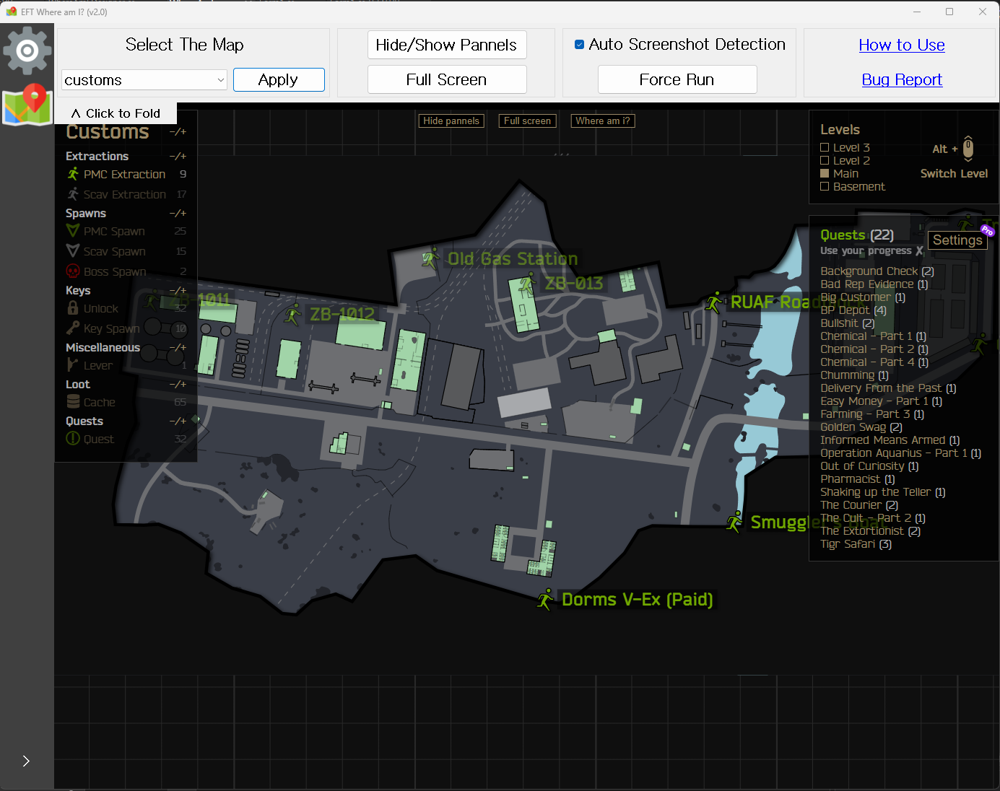

# EFT: Where Am I

[한국어](README.md)

- This is a program that let you directly interact with [Tarkov-Market](https://tarkov-market.com/)—Instantly find where you are, where you should go to get quests and many!
- This program is licensed under the `MIT License`. Use at your risk.
- [Map icons created by Freepik - Flaticon](https://www.flaticon.com/free-icons/map)
 

## How to Use

**1. Select a map.**

Make sure to click the `Apply` button!
 

**2. Take a screenshot during EFT raids.**

- The default screenshot key is `PrtSc`.
- If `Auto Screenshot Detection` has been turned on, your location will be automatically updated each time you take a screenshot.
   

**3. Click the `Force Run` button.**
If you have activated `Auto Screenshot Detection`, you can skip this step.

A red dot indicating your location will appear on the map.

- To update your location, repeat steps 2 and 3.
- You can use the `Hide/Show Panels` or `Full Screen` buttons to view the map wider.
 

**4. For more settings, click the gear icon on the left side.**

- Click the `Change` button to save the path to the desired folder.
- If you think you've made a mistake and the path looks weird, you can use the `Auto Find` button. It will automatically find EFT screenshot folder.
- Localization and automatic screenshot deletion are not implemented yet. Stay tuned for future updates!
