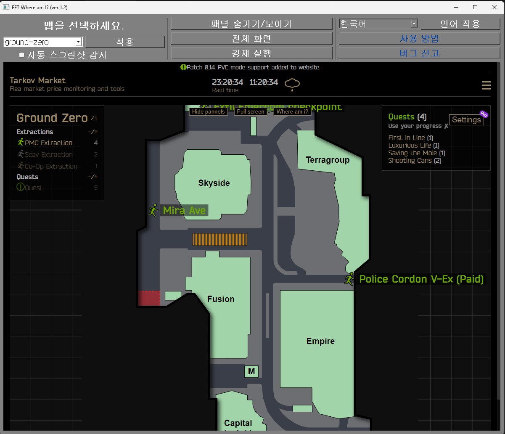
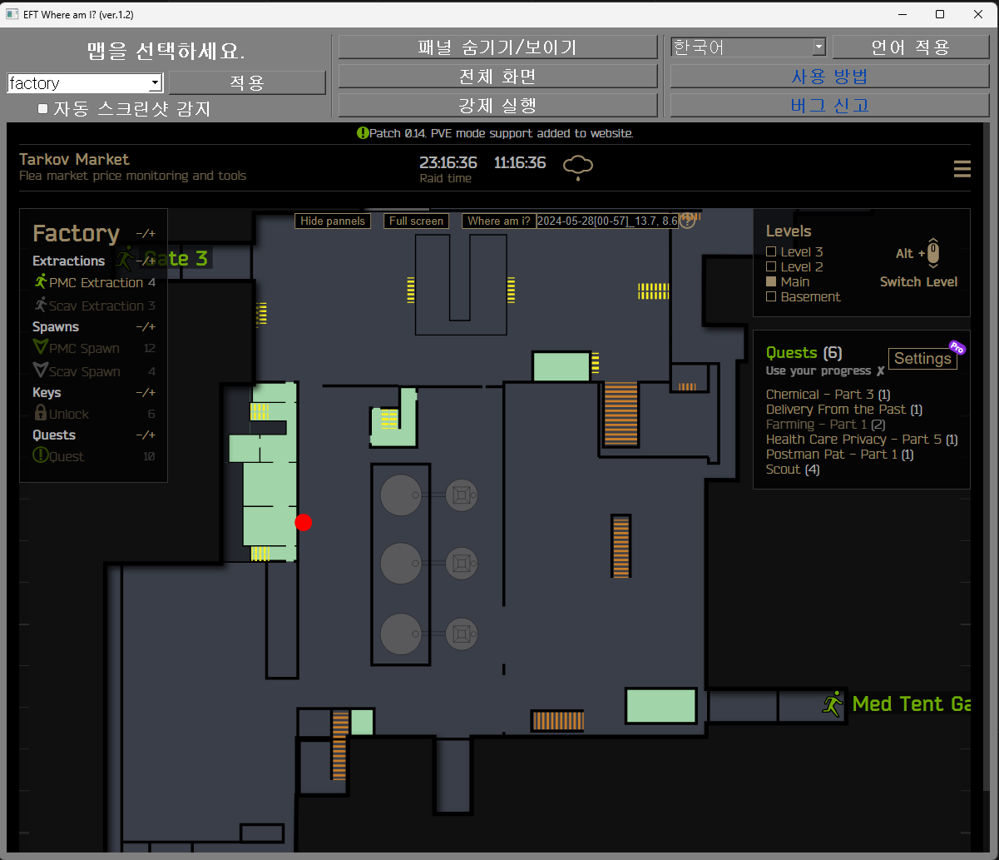

[](https://github.com/karpitony/eft-where-am-i/releases/latest)
[](https://github.com/karpitony/eft-where-am-i/releases)
[](https://github.com/karpitony/eft-where-am-i/releases/latest)
[](./LICENSE)
[](https://www.python.org/)

# eft-where-am-i

- `Tarkov-Market`의 `Maps` 기능을 손쉽게 사용할 수 있도록 도와주는 Python + GUI 프로그램입니다.
- [Rok님의 게시글 및 소스코드](https://gall.dcinside.com/m/eft/2143712)를 기반으로 작성했습니다.
- 본 프로그램은 `MIT 라이선스`이며 **본 프로그램으로 인한 어떠한 피해**(가능성은 거의 없지만 EFT에 의한 제재 등)**에 대하여 책임지지 않습니다.**
- [Map icons created by Freepik - Flaticon](https://www.flaticon.com/free-icons/map)
<br />

1. [사용 방법](#사용-방법)
2. [개발자들을 위해](#개발자들을-위해)
    1. [요구 사항들](#요구-사항들)
    2. [설치](#설치)

## 사용 방법

**1. 맵을 골라주세요.**



맵을 고른 후 꼭 `적용` 버튼을 눌러주세요!
<br />

**2. 타르코프 레이드 안에서 스크린샷을 찍어주세요.**

- 타르코프의 기본 스크린샷 키는 `PrtSc`입니다.
- `자동 스크린샷 감지` 체크박스를 체크하면 스크린샷을 찍을때마다 자동으로 위치가 업데이트 됩니다.
- `자동 스크린샷 감지` 체크박스를 체크하면 3번은 하실 필요가 없습니다.
<br />

**3. `강제 실행` 버튼을 눌러주세요.**



빨간 점의 형태로 맵에 표시됩니다.

- 이동한 후 변경된 나의 위치를 알고싶으면 2번과 3번 과정을 반복해주세요.
- `Hide/Show Pannels`나 `Full Screen` 버튼을 눌러 맵을 더 깔끔하게 볼 수 있습니다.
<br />

## 개발자들을 위해

### 요구 사항들

- Python 3.9 이상
- `requirements.txt`에 적힌 패키지들

### 설치

**아나콘다를 사용할 예정이라면**

1. 새로운 아나콘다 가상환경 만들기

```bash
conda create -n eft-wmi python=3.9
```

2. 패키지 설치

```bash
conda install --yes --file requirements.txt
```

**로컬 환경에서 파이썬을 사용할 예정이라면**

1. 의존성 설치

```bash
pip3 install -r requirements.txt
```